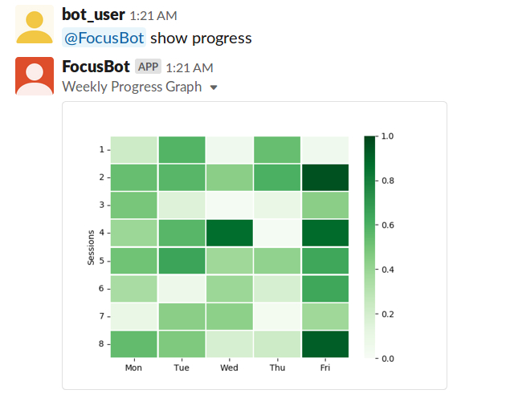

If you are a TA or instructor, you would have received an email from Slack and Atlassian to join the [se510-3.slack.com](https://se510-3.slack.com) Slack workspace and Jira project board. Please login using your NCSU credentials and you should be able to follow the rest of the document.
Otherwise, you are welcome to use the demo user credentials 
##### Email: focusbotuser@gmail.com 
##### Password: focusbot

Once, you are successfully logged, type. Type (from any channel) : **@FocusBot describe commands** . This would return all the commands and their fomat.


## Use Case 1: List open tasks assigned to specific user
```
1. Preconditions
User must have Jira and bot API tokens in the system
2. Main Flow
   User will request list of open tasks assigned to him/her [S1]. Bot will return the list of tasks along with it's details [S2]. 
3. Subflows
  [S1] User will request list of open tasks assigned to him/her
  [S2] Bot will return the list of tasks along with it's details
4. Alternative Flows
  [E1] No open tasks/active sprints available for the specific user
```
### Instructions
* **Input:** Type (from any channel) : **@FocusBot list tasks** 
* **Output:** 
   - **Case 1** If there are no tasks in **To Do** or **In Progress** on Jira project board, you can expect to see a warning message from the bot indicating that as seen in the below image. 
   
   - **Case 2** If there are tasks in **To Do** or **In Progress** on Jira project board, you can expect to see the tasks that are in state **To Do** or **In Progress** . You would see the Project key, Issue name, Issue ID, story points and status for every issue/task. The sample output is as following.
   
 
## Use Case 2:  Create custom tasks
```
1. Preconditions
User must have Jira and bot API tokens in the system
2. Main Flow
   User will request to create custom task using the command create task [S1]. Bot will create a new open task with the given details [S2].
3. Subflows
  [S1] User will request to create custom task using the command create task {Project-key} {Issue-type} {Issue name} {Issue description} {Points estimate} 
  [S2] Bot will create a new open task with the given details
4. Alternative Flows
  [E1] User enters the create task command in an invalid format and the bot responds with corresponding error message 
```
### Instructions
* **Command:** Type (from any channel)<br>
**@FocusBot create task \<project-key\> \<issue-type\> \<issue name\> \<issue description\> \<points estimate\>**<br>
* **Positive Case:** The user will create a new task using the given command <br>
* **Negative Case:** The user will not be able to create a new task by giving an invalid command and the bot responds with an error message<br>
### Positive case:
* **Input: @FocusBot create task SF Task DemoTask1 descritpion1 7**
* **Output:** <br>
<br><br>
We can verify if the task is created by using the command **@Focusbot list tasks**, it will show all the tasks of the user including the newly created task. The following is the output obtained after creating the task and checking the list tasks command. Here, you can see the newly created task is the third one in the list of tasks of the current user.
 <br><br>
We can also verify in Jira, if the task is created. The following image shows the new issue created in jira for the current user.
 <br>

### Negative cases:
#### Case 1: The user gives insufficient number of parameters
* **Input: @FocusBot create task SF Task DemoTask2 7** <br>
Here, the user does not give the issue description
* **Output:** <br>
<br>

#### Case 2: The user gives too many parameters
* **Input: @FocusBot create task SF Task DemoTask2 Description 7 9** <br>
Here, the user gives more number of parameters than required
* **Output:** <br>
<br>

#### Case 3: The user gives invalid project key
* **Input: @FocusBot create task HJ Bug DemoTask2 Description 7** 
* **Output:** <br>
<br>

#### Case 4: The user gives invalid issue type
* **Input: @FocusBot create task SF Problem DemoTask2 Description 7** 
* **Output:** <br>
<br>

#### Case 5: The user gives empty issue name or summary
* **Input: @FocusBot create task SF Story  Description 7** 
* **Output:** <br>
<br>

#### Case 6: The user gives the issue name or summary which already exists in the given project
* **Input: @FocusBot create task SF Story DemoTask1 description1 7**
* **Output:** <br>
<br>

#### Case 7: The user gives empty issue description
* **Input: @FocusBot create task SF Story DemoTask2  7** 
* **Output:**<br>
<br>

#### Case 8: The user gives empty issue name and empty issue description
* **Input: @FocusBot create task SF Epic   7**
* **Output:** <br>
<br>

#### Case 9: The user gives invalid task point estimate, i.e point estimate has text instead of positive integer value 
* **Input: @FocusBot create task SF Epic DemoTask2 description2 7points**
* **Output:** <br>
<br>

#### Case 10: The user gives negative task point estimate
* **Input: @FocusBot create task SF Task DemoTask2 description2 -7** 
* **Output:**<br>
<br>

#### Case 11: The user gives invalid task point estimate, i.e point estimate lesser than 1 or greater than 10
* **Input: @FocusBot create task SF Task DemoTask2 description2 12** 
* **Output:** <br>
<br>

#### Case 12: The user gives invalid command
* **Input: @FocusBot create task HJ Problem DemoTask2  0** <br>
Here, the user gives invalid project key, invalid issue type, empty description and invalid task points estimate
* **Output:** <br>
<br>

#### Case 13: The user gives invalid command
* **Input: @FocusBot create task SF SomeTask DemoTask1  -1** <br>
Here, the user gives invalid issue type, already existing issue name, empty description and invalid task points estimate
* **Output:** <br>
<br>

  
## Use Case 3: Set Pomodoros for the user’s tasks
```
1. Preconditions
User must have Jira and bot API tokens in the system
2. Main Flow
   User will request to start a task using the command Start Task [S1]. Bot will ask the user to update the status of the task and take a break after every session [S4]. Bot will change the status to Closed after 100% completion of the task [S5]. 
3. Subflows
  [S1] User will request to start a task using the command Start Task {TaskId} {Session Time} {Short Break Time} {Long Break Time}
  [S4] Bot will ask the user to update the status of the task and take a break after every session.
  [S5] Bot will change the status to Closed after 100% completion of the task.
4. Alternative Flows
  [E1] No open tasks available for the specific user or the user enters an invalid command
```
### Instructions

#### Positive cases

* **Input:** Type (from any channel) :<br> 
**@FocusBot start task IssueID session_time short_break_duration long_break_duration num_of_sessions**  <br> 
**Note**: All times are in minutes. Floating point decimals are allowed. <br>
Assume that the user wishes to start the issue ID SF-34 with 10 story points. Now the Jira board before starting this task shows the following details under the aforementioned issue.
  <br>
**Example:** let's execute the below command from the demo user: **focusbotuser** <br>
**@FocusBot start task SF-34 0.2 0.1 0.2 2** <br>
After this command is executed (assuming that SF-3 is not already Done), the bot would change the status of the task to **In Progress** if not already, adds the current issue ID as the user's active task thus disabling the user from starting another task. then the bot prompts the user to start their first session for 0.2 minutes (12 seconds). Once the session gets over, the user is asked to take a short break for the said duration - 0.1 minutes = 6 seconds.  Also the user would expect to see an interactive component to enter the percentage completed and also a button to Stop the task. Let's say the user has completed 25% of the work, then they enter the same.

Once, this happens, the Jira board would reflect the change on story point estimate (which captures) the amount of points left to complete. In this case, it would be 10 - 0.25x10 = 7.5. 


At this point there are two possible cases:
- **Case 1:** User decides to stop the current task, by clicking on the **Stop Task** button
When this happens, the bot terminates the session, remove the current task from teh suer's
 <br>
- **Case 2:** User continues with the next session:
The next session would start after the short break and the user restarts working on the task for another session time duration of time. Nevertheless, he/she has the option of stopping the task at any point by clicking on the Stop Task button. Once, the session time gets over, the user is again prompted with the interactive compenent to ented the cumilative percentage of task completed. If the user enters a value lesser than equal to what he/she entered previously then the bot warns that the input is invalid.

Then, if the user realizes their mistake and enters a valid number (greater than 25%), say 50% the bot records this on databse and the Jira board also reflects the change as seen below. the task story point estimate is now 10 - 0.5x10 = 5.

Since this is the last and final session, once the session time gets over, the user will get a long break of the said duration (12 seconds in our case) and once that gets over, the bot alerts the uer of the same and removes the current task from the user's current active task.


#### Negative cases

##### Case 1: Invalid number of parameters
* **Input:** Type (from any channel) :<br> 
**@FocusBot start task SF-34 0.2 0.1 0.2**  <br> 
* **Output:** 


##### Case 2: Attempting to start a task that doesn't exist in the current sprint
* **Input:** Type (from any channel) :<br> 
**@FocusBot start task SF-0 0.2 0.1 0.2 2**  <br> 
* **Output:** 


##### Case 3: Attempting to start a task that is not assigned to the given user
As seen below the task with ID **SF-17** has been assigned to another user **jcheruk** 

* **Input:** Type (from any channel) :<br> 
**@FocusBot start task SF-17 0.2 0.1 0.2 2**  <br> 
* **Output:** 


##### Case 4: Attempting to start a task that is already done and also not assigned to the given user.
* **Input:** Type (from any channel) :<br> 
As seen below the task with ID **SF-1** has been Done and assigned to another user **pbhalas** 

**@FocusBot start task SF-1 0.2 0.1 0.2 2**  <br> 
* **Output:** 


#### Case 5: Short break is greater than session time
* **Input:** Type (from any channel) :<br> 
**@FocusBot start task SF-34 0.2 0.25 0.3 2**  <br> 
* **Output:** 


#### Case 6: Short break is greater than long break and session time
* **Input:** Type (from any channel) :<br> 
**@FocusBot start task SF-34 0.2 0.4 0.3 2**  <br> 
* **Output:** 


#### Case 7: Invalid numbers (negative number of session) and also Case 5
* **Input:** Type (from any channel) :<br> 
**@FocusBot start task SF-34 0.2 0.4 0.3 -2**  <br> 
* **Output:** 


#### Case 8: User asks for more time than they are allowed.
* **Input:** Type (from any channel) :<br> 
**@FocusBot start task SF-36 52 10 30 10**  <br> 
The remaining task points are 4 for SF-34. So, it has to be completed in 4x2 = 8 hours = 8x60 = 480 minutes. We allow a threshold of atmost 30 extra minutes. So the hard limit on the total session time can only be 480 + 30 = 510 minutes. But, the user asks for 10 52 minute sessions , which makes it 520 minutes and exceeds the allowed time. 

* **Output:** 


## Use Case 4: Check the progress
```
1. Preconditions
User must have Jira and bot API tokens in the system
2. Main Flow
   User requests the bot to show progress [S1]. Bot displays the user's progress in the form of heatmap [S2].
3. Subflows
  [S1] User requests the bot to show progress using the command Show Progress
  [S2] Bot displays the user's progress in the form of heatmap 
4. Alternative Flows
  [E1] No progress for the current week available for the specific user 
```
### Instructions
* **Command: @FocusBot show progress** 
* **Positive Case:** The user can check his current week progress heatmap using the given command <br>
* **Negative Case:** The user will not be able to check his current week progress heatmap as no progress exists for the user for that specific week<br>
### Positive case:
* **Input: @FocusBot show progress** 
* **Output:** <br>
<br>

### Negative case:
* **Input: @FocusBot show progress** 
* **Output:** <br>
<br>


## Screencast
Find our link to the screencast [here](https://drive.google.com/file/d/1WgpGRXn51jYZYmVMj0iqgKlG9BNunkIW/view?usp=sharing)
