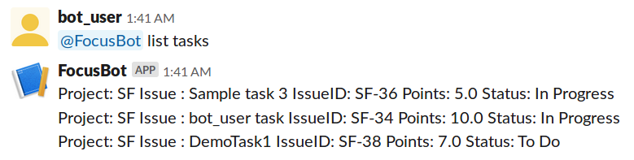
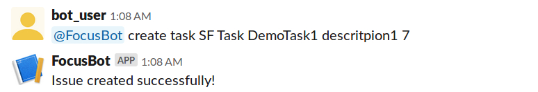
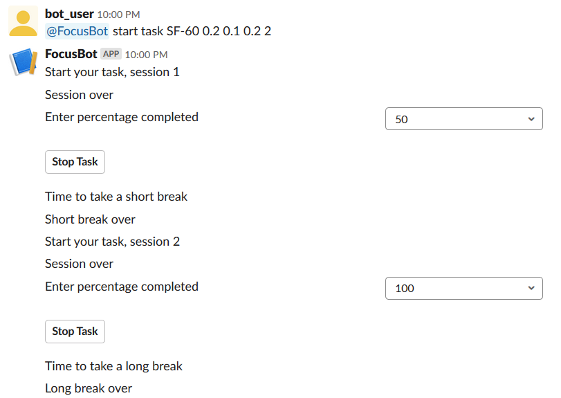
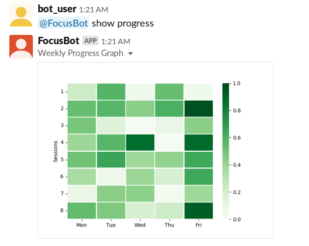

# FocusBot - Report  

## The Problem our bot solved

With many tasks and issues on plate, it is very easy for a software developer to get overwhelmed and lose track of the work which in turn reduces the productivity. Software developers can also forget to update the tasks on JIRA when they are overwhelmed with issues. Also it will be easier for the software developer to see how productive he was at a single glance over a time span. Thus, a systematic approach to productivity is needed in solving this problem which is also focussed for a software developer. This way software developers can also focus on work as well as update their tasks regularly. Our bot was aimed at doing this. We integrated JIRA as our agile project management tool with our bot. Our bot implements the pomodoro technique for increasing focus and productivity. 

Our bot - FocusBot connects to JIRA to list tasks of that user and to create tasks for that user on JIRA. User can start a pomodoro session and select a task to do during that particular session. All the time lengths for pomodoro - session time, short break, long break, number of sessions can be customised. After end of the session, user is prompted to give a percentage completion for that particular task. This is automatically updated on the JIRA under that particular task for that user. Once the task reaches 100% completion, it is automatically moved to 'Done' by the bot itself. A user can ask the bot how his productivity for this week looks. The bot replies with a heat map for the sessions that he attempted with the sensitivity of percentage of story points he completed per session.

## Primary Features and Screenshots
### 1. List open tasks assigned to the user 
The user can request the bot to list open tasks assigned to him/her using the command **@FocusBot list tasks**  Bot will return the list of tasks and their details. 
#### Screenshot of list tasks feature 

### 2. Create custom task for the user
The user can request the bot to create a custom task using the command **@FocusBot create task \<project-key\> \<issue-type\> \<issue name\> \<issue description\> \<points estimate\>**  Bot will create a new to-do task with the given parameters for the user in Jira.
#### Screenshot of create custom task feature 

### 3. Start task of the user by setting pomodoros
The user can request the bot to start a task using the command **@FocusBot start task \<Issue ID\> \<session time\> \<short-break time\> \<long-break time\> \<number of sessions\>**  Bot will then start the pomodoro for the task. After the user completes each session of the task, the bot will ask the user to update the status of the task and to take a short break. After the user completes all the requested number of sessions for the task, the bot will ask the user to take a long break. After the user completes 100% of the task, the bot will change the status of the task to closed.
#### Screenshot of start task feature 

### 4. Check the current week's progress of the user
The user can request the bot to show his/her progress using the command **@FocusBot show progress**  Bot will display the user's progress for that current week in the form of a heat-map.
#### Screenshot of show progress feature 

## Reflection on the development process and project
We had 4 Milestones in our project - Milestone 0 to Milestone 3. In every Milestone we had a set of goals and deliverables to achieve, in some cases we also had to make changes or improve on previous milestones. The following sub-sections give an overview of what we worked on in each milestone.

### Milestone 0
In this milestone, we framed our bot description, problem statement - to build a bot that assists software engineers to efficiently expend time and effort and in turn maximize the productivity. We then went on to decide on our 4 use cases - List tasks, Create task, start Pomodoro and show Progress. Subsequently we chose Slack as our bot platform and an integration with Jira for task management. In the next step we made design sketches in the form of storyboard and wireframes to better understand and represent our usecases. Finally we decided our architecture, components and discussed on design patterns like Factory, Scheduled Task, Mediator, Facade and Interpreter that could guide us in the upcoming milestones.

### Milestone 1
In Milestone-1 we further refined few finer details from our previous milestone. We then, wrote a broiler plate for every use case and integrated it with Slack web hooks.  We used MagicMock Python library to mock JIRA API calls and Database fetches. Finally to test how all the components fit together we did an integration testing with the help of Puppeteer to run automated tests on a browser [screencast](https://drive.google.com/file/d/1c0HmPwjlGJhutx8Q9MUbTzvd1fP14kcD/view?usp=sharing).
In this particular milestone we also used Trello cards to manage our [project board](https://trello.com/focusbot) (this was prior to Kanban which was introduced in Milestone 2)

### Milestone 2
In this Milestone we followed Agile Practices to implement the business logic of our bot. The various approaches and practices we incorporated are detailed as follows.

We made use of Github’s Kanban board for a visual workflow management with cards to represent different stories. We constantly updated our individual progress throughout the 2 weeks with dedicated goals to achieve at the end of each week.  Adding to this, we also incorporated Scrum practices by assigning priority to tasks and executed them in regular intervals. Some of the other Agile practices we followed were peer reviews and pair programming.

#### Scrumban
In this milestone we followed the Scrumban approach. It incorporates both Scrum and Kanban practices. 

##### Scrum
As a part of Scrum, we divided our timeline into two sprints and ensured the we work at regular intervals. For every sprint we curated a specific set of goals and task points to be completed in a priority basis. The total task points in each sprint was equally divided amongst the 4 members. After completing a feature, there were code reviews by the peers, once that is over the feedbacks are passed onto the developer who decides to make further changes (if necessary) on a timely basis. Throughout hte milestone we had regular scrum meetings (standups) where we discussed agenda, daily plan, use case refinements and updated the [meeting minutes](Milestone-2/MeetingNotes).

##### Kanban
We used Github's [Kanban board](https://github.ncsu.edu/csc510-fall2019/CSC510-3/projects/2) for a visual workflow management to track the progress of our tasks. This dedicated project board has columns like To Do, In Progress and Done (similar to Jira) along with the progress made in sprints 1, 2 and 3 to clearly demarcate the targetted tasks that were completed in each of the sprints. We designed our tasks/stories based on SMART approach. Every card on the board represents a task/story. The card has attributes like task title, optional description, number of story points and assignee. Each team member is responsible for working on the tasks they were assigned to and keep updating the status and pending task points on their cards iteratively. We ensured that not too many tasks are either in the state of In Progress or To Do at the same time. This helped us to pace our work effectively and address tasks that have been on To Do for a very long time. 

#### Agile
Agile is a software development methodology where the project is divided into several stages where the team members collaborate and continuously iterate towards improvement. This methodology is what we precisely incorporated throughout the development of our project. In every iteration we had a specific set of goals and deliverables to achieve and we constanly worked on our part. We were flexible to changing requirements that made it possible to incorporate subtle variations and improvements to the scope of our usecases. 

##### Peer Reviews
Peer reviews were an essential part of our development cycle. After a developer completes a given one of their tasks, there would be a peer reviewer assigned whose responsibility is to review the code, check if it meets the project requirements and recommend any feedbacks/changes. The reviewer not only checks the correcness, but ensures the quality of the code, efficiency (time and space complexity) and suggest improvements. If the reviewer faces difficulty to understand any code segment, they sync up with the developer for a one-on-one who walks through the code, talks about their approach before the reviewer does further scruitiny.

##### Pair Programming
Pair programming is a popular agile practice we often used in our project. For certain tasks we had to collaborate simultaneously on the same machine. Pair programming involves 2 roles - the driver who types the code and navigator who oversees the code direction. The developers keep swapping their roles after a specific duration.

### Milestone 3
In our last Milestone, we deployed our Bot’s server to EC2 using an Ansible script. We then wrote our [Acceptance testing](ACCEPTANCE_TESTING.md) document that provides a lucid picture of the different possible scenarios the end user can run into for all our usecases. The screencast can be found [here](https://drive.google.com/file/d/1WgpGRXn51jYZYmVMj0iqgKlG9BNunkIW/view). Finally, we deployed a Jenkins server and created a job to build the repository and run tests after every commit which ensures Continuous Integration.

#### Configuration Management
We used configuration management tools to fully provision the configuration of our software and hardware assets on the remote environment to deploy our bot. We chose EC2 instances to deploy our bot. We wrote an [Ansible playbook](playbook.yaml) to enforce this configuration management and automate the process of bot deployment which can be easily scaled to multiple servers in the future for better load balancing and fault tolerance. The demo of the same can be seen [here](https://drive.google.com/file/d/16JholtXMWFopgrUsa-tCki8UMD8OPatq/view)

#### Continuous Integration
Continuous Integration is a software development practice where developers regularly check-in and integrate code into a shared repository several times a day. For this purpose we deployed a Jenkins server. After every commit, the server builds the repository and runs automated tests to verify that the code is integrated properly and errors are detected early. This pipeline ensures that only the correct code is pushed to production quickly. The demo of the same can be seen [here](https://drive.google.com/file/d/1cjL4PBK8IbxjjiQu_C6f1ka0oiEHI-Pg/view)

Our final presentation/demo can be accessed [here](https://drive.google.com/file/d/1WgpGRXn51jYZYmVMj0iqgKlG9BNunkIW/view)

## Limitations and Future Work

- At present, the bot is supported for one slack team. In future, focus should be on scaling the bot and distributing the app so that it can be installed from the Slack App directory.
- At present, we give similar functionalities to all the team members. In future, we can dynamically decide the functionalities of the team member based on their position. 
- The above specified change can help managers look at the progress graph of the other team members while the team members might not have the additional functionality to look at the progress graph of their colleagues.
- Currently, we support only Jira as the Project Management tool. In future, our app can be extended to support other Project Management tools.
- Currently, the progress graph is shown for a week. It can be extended to show progress like the github contributions graph. Ideally, the app can be extended to support dynamic graph generation based on user requirements.
- At present, we do not automatically suggest pomodoro times based on the task and user's past history. We can integrate intelligent algorithms  to help suggest a suitable pomodoro session times.
- Additionally, to increase the scope of the app, we can generate daily task progress documents which will help during Daily Stand-Up. Team members also can leave comments incase of any blockers. All this information will lead to swift and informative Daily Scrum Meetings.
